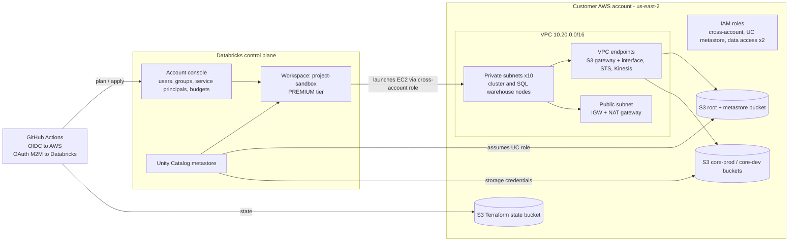
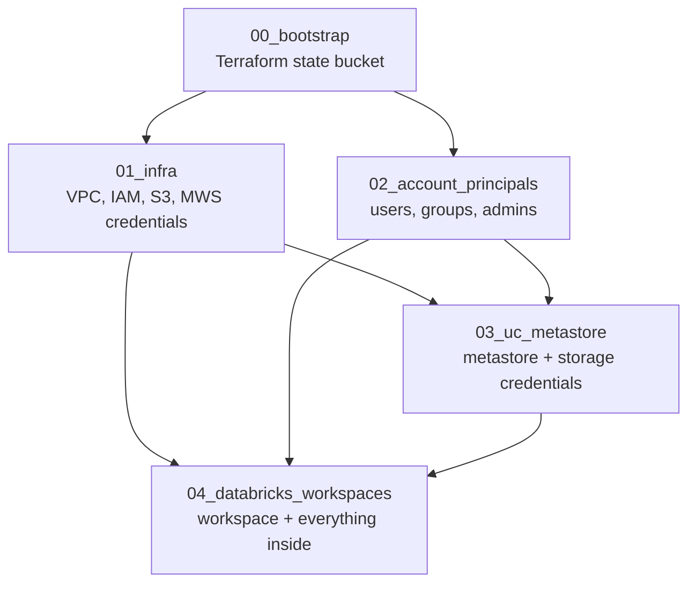

# Databricks on AWS — Lakehouse Platform as Code


This is Terraform code that builds a complete, governed **Databricks Lakehouse on AWS** from an empty AWS account: networking, IAM, storage, the Unity Catalog metastore, account identities, and a ready-to-use workspace with compute, catalogs, permissions and budget alerts.

You add a user, a catalog or a permission by **editing a YAML file**. Terraform does the rest, and GitHub Actions deploys it through a pull-request workflow.

### Highlights

- **Configuration-driven.** Three YAML files in [`configs/`](configs/) are the single source of truth. No Terraform changes are needed for everyday work.
- **Layered stacks.** Five independent Terraform states (`00`–`04`) keep a mistake in one stack from affecting the others.
- **Unity Catalog end to end.** The code creates the metastore, isolated storage credentials, external locations with managed file events, dev/QA/prod catalogs, schemas, and one sandbox schema per developer.
- **Least privilege by design.** Each storage credential gets its own IAM role scoped to one bucket. Trust policies are pinned to Databricks-generated external IDs, and all buckets are TLS-only.
- **Private data paths.** S3 gateway and interface endpoints keep bulk data traffic inside AWS. (STS and Kinesis endpoints are declared but not yet attached to subnets — see [Cost Notes](#cost-notes).)
- **Cost guardrails.** Clusters auto-terminate, SQL warehouses auto-stop, and a monthly budget alert is set per workspace.
- **Keyless CI/CD.** GitHub Actions uses AWS OIDC, so no long-lived AWS keys are stored. It runs lint, validate and plan on each PR, and applies after a manual approval gate.

---

## Table of Contents

1. [Architecture](#architecture)
2. [What Gets Deployed](#what-gets-deployed)
3. [Repository Layout](#repository-layout)
4. [How It Works](#how-it-works)
5. [Getting Started](#getting-started)
6. [CI/CD](#cicd)
7. [Day-2 Operations](#day-2-operations)
8. [Security Design](#security-design)
9. [Cost Notes](#cost-notes)
10. [Tearing Down](#tearing-down)
11. [Documentation Index](#documentation-index)

---

## Architecture



For a deeper look at networking, the IAM trust flow and the governance model, see [docs/architecture.md](docs/architecture.md).

### Stack dependency graph



---

## What Gets Deployed

### AWS

| Service | Resource | Details |
|---------|----------|---------|
| **S3** | Terraform state bucket | Versioned, SSE-AES256, all public access blocked (`00_bootstrap`) |
| **VPC** | VPC `10.20.0.0/16` | DNS hostnames/support on. Built with `terraform-aws-modules/vpc` 5.7.0 |
| | Subnets | 1 public `/24` plus 10 private `/24`s spread across AZs. Each workspace uses 2 private subnets |
| | Internet + NAT gateway | IGW and a single NAT gateway for outbound traffic from private subnets |
| | Security groups | VPC default SG (intra-SG traffic plus all egress, used by the workspace) and an extra egress-only SG |
| | VPC endpoints | **S3 Gateway** (free) and **S3 Interface** (private DNS, 1 ENI per AZ). **STS** and **Kinesis Streams** are declared but currently have no subnets, so they carry no traffic |
| **IAM** | Cross-account role | Lets the Databricks control plane launch EC2 in your VPC (policy generated by the Databricks provider) |
| | Unity Catalog role | Used by the metastore to reach the root bucket, plus permissions for managed file events (SNS/SQS) |
| | Data-access roles (×2) | One per storage credential, each scoped to its own bucket and prefix |
| **S3** | Root / metastore bucket | Workspace root storage (DBFS) plus UC metastore storage under `/metastore`. TLS-only, SSE, DBFS denied on `/metastore/*` |
| | `core-prod` / `core-dev` buckets | External data buckets behind UC external locations. TLS-only, SSE, role-restricted |
| **SNS / SQS** | File event queues | Created **by Databricks at runtime** when external locations have `enable_file_events: true` |

### Databricks account level

| Resource | Details |
|----------|---------|
| MWS credentials, storage configuration, network | Register the cross-account role, root bucket and VPC/subnets/SG with the account |
| Workspace `project-sandbox` | PREMIUM tier, customer-managed VPC |
| Unity Catalog metastore | `project-dbk-uc-us-east-2-metastore`, owned by the admin group, with a default data-access configuration |
| Storage credentials (×2) | `project-dbk-uc-prod-access` and `project-dbk-uc-dev-access`, in `ISOLATED` mode and bound to specific workspaces |
| Admin group | `project-dbk-admins`, with the `account_admin` role |
| Users, groups, memberships | Taken from `principal_configs.yml`. Supports account-level group and service principal rule sets |
| Budget | Monthly cumulative-spend alert per workspace ($200 for the sandbox), sent by email |

### Inside the workspace

| Resource | Details |
|----------|---------|
| Metastore assignment + storage credential bindings | Connects the workspace to UC and exposes only the credentials it's allowed to use |
| External locations (×2) | `project_core_prod` and `project_core_dev`, with managed file events enabled |
| Catalogs (×3) | `project_dev_db`, `project_qa_db`, `project_prod_db`, all in `ISOLATED` mode |
| Schemas (×12) | `raw`, `staging`, `intermediate` and `mart` in each catalog |
| Developer schemas | One `dev_<first>_<last>` schema per workspace user in the dev catalog, owned by that user |
| SQL warehouses (×2) | Default PRO warehouse (2X-Small, up to 3 clusters, 10-min auto-stop) plus one configurable warehouse |
| All-purpose cluster | `project-dbk-shared`: autoscaling 1–5 workers, 15-min auto-termination, latest Spark 4 LTS, smallest local-disk node |
| Permissions | Workspace assignments (ADMIN/USER) and UC grants on catalogs, schemas, external locations and storage credentials. Cluster and warehouse ACLs |
| *Optional* | Lakehouse Federation catalogs (secrets read from AWS Secrets Manager) and AI Gateway budgets. Supported, but not enabled in the current config |

---

## Repository Layout

```
databricks_aws_infra/
├── configs/                          # Single source of truth (YAML)
│   ├── project_configs.yml           #   Region, account ID, network, metastore, storage credentials, tags
│   ├── principal_configs.yml         #   Account users, service principals, groups, memberships
│   └── workspace_configs.yml         #   Per-workspace compute, catalogs, schemas, locations, grants, budgets
│
├── stacks/                           # Deployable units, each with its own state (apply in order)
│   ├── 00_bootstrap/                 #   S3 bucket for remote state (local state)
│   ├── 01_infra/                     #   VPC, IAM, S3, MWS credentials/storage, optional PrivateLink
│   ├── 02_account_principals/        #   Admin group, users, groups, memberships
│   ├── 03_uc_metastore/              #   UC metastore, storage credentials, trust-policy finalization
│   └── 04_databricks_workspaces/     #   One <workspace>.tf per workspace (creation + setup)
│
├── modules/                          # Reusable building blocks
│   ├── project_data/                 #   Parses and normalizes the YAML configs, consumed by every stack
│   ├── aws-databricks-base-infra/    #   VPC, endpoints, IAM roles, root bucket, storage buckets
│   ├── aws-databricks-unity-catalog/ #   Metastore + default data access
│   ├── account-principals-managed/   #   Account users, SPs, groups, memberships, rule sets
│   ├── databricks-workspace-creation/#   MWS network + workspace
│   └── databricks-workspace-setup/   #   Everything inside a workspace
│
├── docs/                             # Architecture, configuration reference, CI/CD guide
├── scripts/                          # Setup and state-import helpers (see scripts/README.md)
├── .github/workflows/                # PR validation, deploy, targeted deploy
├── .pre-commit-config.yaml           # fmt, tflint, codespell, hygiene hooks
├── .tflint.hcl                       # TFLint rules (terraform + aws rulesets)
├── .terraform-docs.yml               # Generates TF_README.md in each stack/module
└── .terraform-version                # 1.13.3 (tfenv)
```

Each stack and module has a hand-written `README.md` (purpose and design) and a generated `TF_README.md` (inputs, outputs, resources).

---

## How It Works

### 1. YAML in, normalized data out

Every stack starts with:

```
module "project_data" {
  source = "../../modules/project_data"
}
```

[`modules/project_data`](modules/project_data/) reads the three YAML files, fills in defaults, and makes names safe for Databricks (for example `-` becomes `_` in catalog names). It also derives the relationships between them:

- **workspace → groups** comes from `workspace_configs.yml`.
- **workspace → users** is computed: a user belongs to a workspace if any of their groups is assigned to it. That list drives the per-developer schemas.

### 2. Stacks talk through remote state

Stacks never share resources directly. `03` and `04` read outputs from earlier stacks through `terraform_remote_state` on the S3 backend:

| Stack | State key | Reads from |
|-------|-----------|------------|
| `00_bootstrap` | local `bootstrap.tfstate` | — |
| `01_infra` | `infra/terraform.tfstate` | — |
| `02_account_principals` | `account_principals/terraform.tfstate` | — |
| `03_uc_metastore` | `uc/terraform.tfstate` | `infra` |
| `04_databricks_workspaces` | `workspaces/terraform.tfstate` | `infra`, `uc` (and looks up groups created by `02`) |

### 3. Two providers, two scopes

- `databricks.mws` points at `https://accounts.cloud.databricks.com` and manages account-level objects.
- A per-workspace provider (for example `databricks.sandbox_workspace`) points at the new workspace's URL and manages objects inside it.

Both authenticate with the same **account-level service principal** (OAuth M2M).

---

## Getting Started

### Prerequisites

| Tool | Version | Notes |
|------|---------|-------|
| [Terraform](https://developer.hashicorp.com/terraform/install) | `1.13.3` | Use [tfenv](https://github.com/tfutils/tfenv); `.terraform-version` pins it |
| [AWS CLI](https://docs.aws.amazon.com/cli/latest/userguide/getting-started-install.html) | v2 | **Required at apply time.** Some trust policies are finalized with `aws iam update-assume-role-policy` |
| [TFLint](https://github.com/terraform-linters/tflint) | `0.50.0` | Lint |
| [pre-commit](https://pre-commit.com/) | latest | Git hooks |

You also need:

- An **AWS account**, with credentials that can create VPC, IAM and S3 resources.
- A **Databricks account on AWS** (E2, Premium or higher). Note your *Account ID* from the account console.

> Developed on Ubuntu. On Windows use WSL2. On macOS use `brew` instead of `apt`.
> `bash scripts/setup.sh` installs tfenv, Terraform, TFLint and pre-commit for you.

### Step 1 — Create the Databricks service principal

1. In the [Databricks account console](https://accounts.cloud.databricks.com), go to **User management → Service principals → Add**.
2. Give it the **Account admin** role.
3. Under **Secrets → Generate secret**, copy the *Client ID* and *Secret*.
4. Create your local `.env` file:

   ```
   cp .env.example .env      # .env is git-ignored
   # fill in TF_VAR_databricks_client_id / TF_VAR_databricks_client_secret
   set -a && source .env && set +a
   ```

### Step 2 — Configure the project

Edit the YAML files in `configs/`. At minimum, set these fields in `project_configs.yml`:

```
project_name: project-dbk-infra-east        # prefix for most resource names
aws_region: us-east-2
databricks_account_id: <your-account-id>
backend_state_bucket_name: <globally-unique-bucket>
metastore_config:
  metastore_bucket_name: <globally-unique-bucket>
```

S3 bucket names must be **globally unique**. Every field is described in [docs/configuration.md](docs/configuration.md).

> **Heads-up:** Terraform `backend` blocks can't use variables. If you change the region or the state bucket name, also update `backend "s3"` in each `stacks/*/provider.tf`, the hardcoded region in `stacks/04_databricks_workspaces/main.tf`, and `stacks/00_bootstrap/providers.tf`.

### Step 3 — Bootstrap the state backend (one time)

```
cd stacks/00_bootstrap
terraform init && terraform apply
```

This stack uses **local state** (`bootstrap.tfstate`, git-ignored). Keep that file somewhere safe.

### Step 4 — Deploy the stacks in order

Run them **one at a time**, in this order, reviewing each plan before you approve the apply. Paths continue from the previous step, so stay in the same terminal.

**4.1 — AWS infrastructure** (VPC, IAM roles, S3 root bucket, MWS registrations):

```
cd ../01_infra
terraform init && terraform apply
```

**4.2 — Account principals** (users, groups, admin group):

```
cd ../02_account_principals
terraform init && terraform apply
```

**4.3 — Unity Catalog metastore** (metastore + storage credentials):

```
cd ../03_uc_metastore
terraform init && terraform apply
```

**4.4 — Workspaces** (workspace, catalogs, compute, permissions, budget):

```
cd ../04_databricks_workspaces
terraform init && terraform apply
```

> Starting from a fresh terminal instead? Use the full path, for example `cd stacks/01_infra` from the repo root.

A first deployment takes about 15–25 minutes; workspace provisioning is the slowest part. When it finishes, log in at the workspace URL shown in the Databricks account console.

---

## CI/CD

Three GitHub Actions workflows live in [`.github/workflows/`](.github/workflows/):

| Workflow | Trigger | What it does |
|----------|---------|--------------|
| **PR Validation** | Pull request → `master` | `terraform fmt -check`, TFLint, `terraform validate` on every stack, then an **informational plan** (plan logs are uploaded as artifacts) |
| **Deploy** | Push → `master` | Lint → validate → plan + apply for stacks `01`–`04`, gated by the `production` environment (manual approval) |
| **Deploy (targeted)** | Manual (`workflow_dispatch`) | Pick `infra`, `databricks`, `workspaces` or `all` to deploy just part of the platform |

AWS access uses **OIDC role assumption**, so no AWS keys are stored in GitHub. Setup steps (IAM OIDC provider, trust policy, repository secrets, environment protection) are in [docs/ci-cd.md](docs/ci-cd.md).

`00_bootstrap` is deliberately left out of CI. It's a one-time manual step that creates the backend the pipelines rely on.

---

## Daily Operations

| Task | Where |
|------|-------|
| Add a user | `principal_configs.yml` → `users`, then list their `groups`. If a group is assigned to a workspace, the user gets access **and** a personal dev schema |
| Add a group | `principal_configs.yml` → `groups`, then assign it in `workspace_configs.yml` → `groups[].assignments` |
| Grant access | `workspace_configs.yml` → `catalog_privileges`, `schema_privileges`, `external_location_privileges`, `storage_credential_privileges`, `cluster_privileges`, `sql_warehouse_privileges` |
| Add a catalog or schema | `workspace_configs.yml` → `catalogs` / `schemas` (one schema entry can fan out to several catalogs) |
| Add a cluster or warehouse | `workspace_configs.yml` → `all_purpose_clusters` / `sql_warehouses` |
| Add a storage credential and bucket | `project_configs.yml` → `storage_credential_configs`, apply `01` then `03`, then reference it in the workspace's `external_locations` and `storage_credential_names` |
| Add a new workspace | See [stacks/04_databricks_workspaces/README.md](stacks/04_databricks_workspaces/README.md#adding-a-new-workspace) |
| Adopt existing objects | `terraform import`. See [scripts/README.md](scripts/README.md) and the stack 04 FAQ |

Typical flow: create a branch, edit the YAML, open a PR, review the plan in the PR checks, merge, and approve the `production` deployment.

---

## Security Design

- **No static AWS keys in CI.** GitHub OIDC → `sts:AssumeRoleWithWebIdentity`.
- **Secrets stay out of git.** Databricks credentials are supplied as `TF_VAR_*` environment variables (from a local `.env` or GitHub secrets). The workspace stack marks the client secret `sensitive`.
- **Confused-deputy protection.**
  - The cross-account role trusts Databricks only with your account ID as the external ID.
  - Each storage credential role trusts the Unity Catalog master role only with the **external ID Databricks generates for that credential**.
  - Each role can also assume itself, which Databricks requires.
- **Isolation.** Catalogs and storage credentials use `ISOLATED` mode and are bound only to the workspaces that need them.
- **Least-privilege S3.** Each data-access role is limited to one bucket (and optionally one prefix). Bucket policies deny non-TLS requests. The root bucket denies DBFS access to `/metastore/*`.
- **Encryption and public access.** SSE-AES256 on every bucket; public access blocks on every bucket.
- **Governed access model.** Permissions are granted to **groups**, never to individuals: account → workspace → catalog → schema → external location.
- **Guardrails in the repo.** pre-commit runs `detect-private-key`, codespell, fmt and TFLint. TFLint enforces the `ManagedBy` / `Owner` default tags on the AWS provider.

---

## Cost Notes

Real AWS costs for this deployment in `us-east-2`, from Cost Explorer (unblended). August 2026 is the reference: the first full calendar month with the platform fully deployed.

| Component | Usage type | Quantity | Monthly cost |
|-----------|------------|----------|--------------|
| NAT gateway | `NatGateway-Hours` | 744 h @ $0.045 | $33.48 |
| S3 interface endpoint (1 ENI per AZ) | `VpcEndpoint-Hours` | 2,232 h @ $0.010 | $22.32 |
| Elastic IP on the NAT gateway | `PublicIPv4:InUseAddress` | 744 h @ $0.005 | $3.72 |
| S3 storage and requests | — | — | $0.07 |
| Secrets Manager | — | — | ~$0.00 |
| **Total** | | | **~$59.59/month** |

September tracked the same rate: $22.84 over the first 12 days.

### This is an idle bill

`EC2 - Instances` was **$0.00** for the month, and there were no `NatGateway-Bytes` data-processing charges. No cluster ran in that period, so **the entire amount is fixed infrastructure that bills whether or not anyone logs in**.

That's the cost shape of a governed Lakehouse: compute is the line everyone budgets for, and it auto-terminates to zero when idle — clusters after 15 minutes, SQL warehouses after 10. The network floor underneath it does not. Databricks DBUs are billed separately by Databricks and depend entirely on your workload.

A **monthly budget alert** (`budget_amount` in `workspace_configs.yml`) emails you when Databricks list-price spend passes the threshold. It covers Databricks spend only; the AWS costs above are not part of it.

> Reproduce these numbers with `aws ce get-cost-and-usage --group-by Type=DIMENSION,Key=USAGE_TYPE`. For the Databricks side, query `system.billing.usage` or download billable usage from the account console.

---

## Tearing Down

Destroy in **reverse order**, one stack at a time. Review each destroy plan before you confirm it.

**1 — Workspaces** (workspace, catalogs, compute, permissions):

```
cd stacks/04_databricks_workspaces
terraform destroy
```

**2 — Unity Catalog metastore** (metastore + storage credentials):

```
cd ../03_uc_metastore
terraform destroy
```

**3 — Account principals** (users, groups, admin group):

```
cd ../02_account_principals
terraform destroy
```

**4 — AWS infrastructure** (VPC, NAT, endpoints, IAM, buckets):

```
cd ../01_infra
terraform destroy
```

**5 — Bootstrap** (Terraform state bucket, last of all):

```
cd ../00_bootstrap
terraform destroy
```

> Starting from a fresh terminal instead? Use the full path, for example `cd stacks/04_databricks_workspaces` from the repo root.

Things to know before you run it:

- **Metastore.** It has no `force_destroy`. Empty or drop its catalogs first (stack 04 handles that), or Databricks will refuse to delete it.
- **Buckets.**
  - The storage buckets and the state bucket use `force_destroy = true`, so their **data is deleted along with them**.
  - The root bucket does not use `force_destroy`. Empty it manually first.
- **NAT gateway.** Destroying `01_infra` stops the ongoing NAT and endpoint charges.

---

## Documentation Index

| Document | Contents |
|----------|----------|
| [docs/architecture.md](docs/architecture.md) | Network layout, IAM trust flows, storage and Unity Catalog model, design decisions |
| [docs/configuration.md](docs/configuration.md) | Field-by-field reference for all three YAML files |
| [docs/ci-cd.md](docs/ci-cd.md) | GitHub Actions workflows, OIDC setup, secrets, approval gates |
| `stacks/*/README.md` | Purpose, resources, dependencies and gotchas per stack |
| `modules/*/README.md` | Purpose and interface per module |
| `**/TF_README.md` | Generated inputs, outputs and resources (terraform-docs) |
| [scripts/README.md](scripts/README.md) | Helper scripts |

Regenerate the `TF_README.md` files after changing variables or outputs.

Install the tool once:

```
bash scripts/install-terraform-docs.sh
```

Then run it **from inside** the stack or module directory you changed:

```
cd stacks/01_infra
terraform-docs markdown table --output-file TF_README.md --output-mode replace .
```

The same command works in any directory that contains `.tf` files, for example `modules/project_data` or `modules/databricks-workspace-setup`. Run it from inside the directory: from the repo root, terraform-docs picks up the `recursive` setting in `.terraform-docs.yml` and looks for a `stacks/` subfolder that isn't there.

---

## References

- [Databricks Terraform provider](https://registry.terraform.io/providers/databricks/databricks/latest/docs)
- [Databricks: customer-managed VPC](https://docs.databricks.com/aws/en/security/network/classic/customer-managed-vpc)
- [Databricks: Unity Catalog storage credentials on AWS](https://docs.databricks.com/aws/en/connect/unity-catalog/cloud-storage/storage-credentials)
- [Databricks: PrivateLink endpoint services by region](https://docs.databricks.com/aws/en/resources/ip-domain-region#privatelink-vpc-endpoint-services)
- [terraform-aws-modules/vpc](https://registry.terraform.io/modules/terraform-aws-modules/vpc/aws/5.7.0)
- [GitHub Actions: OIDC with AWS](https://docs.github.com/en/actions/security-for-github-actions/security-hardening-your-deployments/configuring-openid-connect-in-amazon-web-services)
