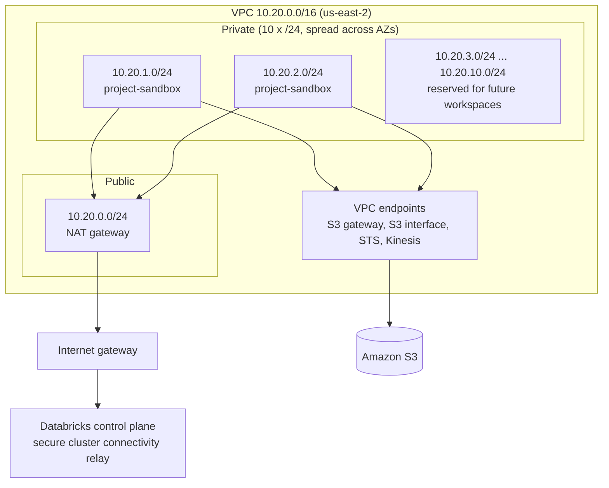
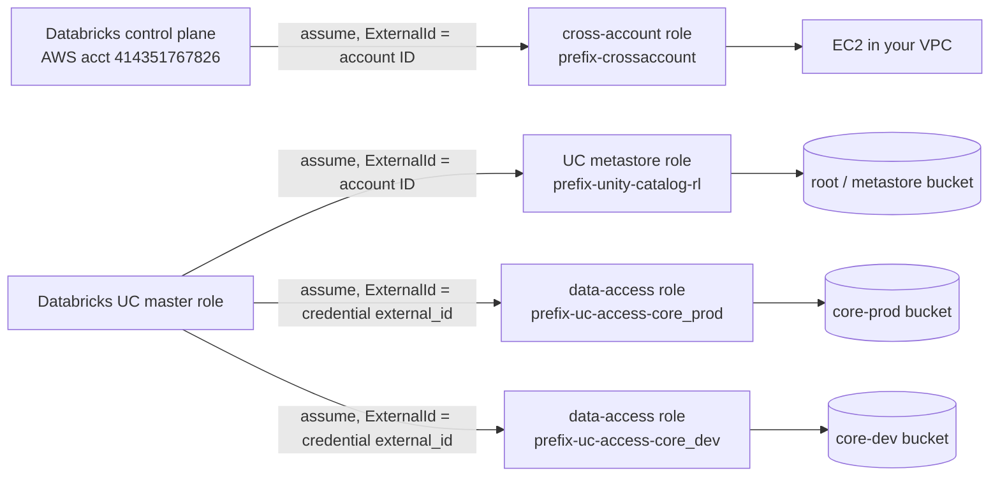

# Architecture

This document explains **how** the platform is put together and **why** it was designed that way. For the list of resources, see the [README](../README.md#what-gets-deployed).

- [Control plane vs. data plane](#control-plane-vs-data-plane)
- [Network](#network)
- [IAM and trust relationships](#iam-and-trust-relationships)
- [Storage layout](#storage-layout)
- [Unity Catalog model](#unity-catalog-model)
- [Access control model](#access-control-model)
- [Design decisions](#design-decisions)

---

## Control plane vs. data plane

Databricks on AWS runs in two places:

| Plane | Where | What runs there |
|-------|-------|-----------------|
| **Control plane** | Databricks' AWS account | Web UI, REST APIs, job scheduler, Unity Catalog service, account console |
| **Classic data plane** | **Your** AWS account, inside the VPC this project creates | EC2 instances for all-purpose clusters and classic/pro SQL warehouses |

The control plane needs permission to launch EC2 in your account. That's the **cross-account role**. Your compute needs to reach the data in S3 and connect back to the control plane. That traffic goes through the **VPC, NAT and VPC endpoints**.

---

## Network



### Subnets

`modules/aws-databricks-base-infra/vpc.tf` divides the VPC CIDR using `cidrsubnet`:

- `private_subnet_prefix_length = 24` and `subnet_block_to_create = 10` are set in `stacks/01_infra/main.tf`.
- Block `0` becomes the single public subnet.
- Blocks `1..10` become private subnets. The VPC module spreads them round-robin across the region's AZs.
- A Databricks workspace needs **at least 2 private subnets in different AZs**. `stacks/04_databricks_workspaces/locals.tf` gives the sandbox private subnets `[0]` and `[1]`, leaving 8 for future workspaces.

### Egress

- Clusters get **no public IPs** (secure cluster connectivity). They reach the control plane relay outbound through the **single NAT gateway**.
- One NAT gateway is a cost/availability trade-off. If you need AZ-level resilience, set `single_nat_gateway = false`.

### VPC endpoints

| Endpoint | Type | Why |
|----------|------|-----|
| S3 | Gateway | Free. Routes S3 traffic from private and public route tables through AWS instead of the NAT |
| S3 | Interface (private DNS) | Covers S3 IPs outside the gateway prefix list, so *all* S3 traffic resolves privately |
| STS | Interface ⚠️ | *Intended* to let clusters assume instance-profile and UC roles privately. **Currently created with no subnets (0 ENIs), so it carries no traffic** — that traffic still exits via the NAT |
| Kinesis Streams | Interface ⚠️ | *Intended* for the Databricks logging/telemetry path. Same issue: no subnets, no ENIs |

> The `sts` and `kinesis-streams` entries in `vpc.tf` pass `route_table_ids` (a Gateway-endpoint argument) rather than `subnet_ids`, so AWS creates the endpoints with zero network interfaces. They cost nothing and do nothing. Verified against the live account and the billing data in the [README's Cost Notes](../README.md#cost-notes). To activate them, give them `subnet_ids = local.interface_endpoint_subnet_ids` like the S3 interface endpoint (about +$22/month each across 3 AZs).

Interface endpoints are placed in **one subnet per AZ** (an AWS requirement), selected in `local.interface_endpoint_subnet_ids`.

### Security groups

- **VPC default SG** (`<prefix>-sg`) is the one the workspace uses. It allows all traffic between members of the SG, as Databricks requires for cluster nodes, plus all egress.
- **`<prefix>-egress-sg`** is an extra egress-only SG, exported for future use.
- When back-end PrivateLink is enabled, two more SGs are created for the workspace and relay endpoints. They allow only the Databricks ports: 443, 2443, 3306, 6666, 8443–8451.

### Optional: back-end PrivateLink

Setting `enable_backend_private_link: true` in `project_configs.yml`, together with the regional endpoint service names, makes `01_infra` do the following:

1. Validate that the service names match `aws_region`, and fail fast with a clear precondition error if they don't.
2. Create Interface endpoints for the workspace (REST API), the SCC relay and, optionally, service-direct.
3. Register them with Databricks (`databricks_mws_vpc_endpoint`) and create `databricks_mws_private_access_settings`.

> **Current status:** the workspace network config (`databricks_mws_networks`) doesn't reference these endpoints yet. Workspaces still use the public relay over the NAT.

---

## IAM and trust relationships

Four kinds of IAM role are involved. Each one trusts a specific Databricks principal, and each trust is pinned by an **external ID**.



### The chicken-and-egg problem, and how it's solved

Unity Catalog needs two things that don't exist when the role is first created:

1. The role must be able to **assume itself** (a Databricks requirement since 2023). AWS won't let a trust policy reference a role ARN until that role exists.
2. A storage credential role must trust the **external ID Databricks generates** when the storage credential is created. That ID only exists *after* the credential is created, and the credential in turn needs the role ARN.

The stacks solve this in two phases:

| Phase | Stack | Action |
|-------|-------|--------|
| 1 | `01_infra` | Create each role with a *minimal* trust policy. `ignore_changes = [assume_role_policy]` stops Terraform from reverting it later |
| 2a | `01_infra` | `terraform_data` + `local-exec` rewrites the UC metastore role's trust policy to add **SelfAssume** |
| 2b | `03_uc_metastore` | Create `databricks_storage_credential`, read its `external_id`, and rewrite each data-access role's trust policy (UC master + `ExternalId` + SelfAssume) |

`triggers_replace` hashes the inputs, so the trust policy is rewritten whenever the role ARN or the policy document changes.

---

## Storage layout

| Bucket (from config) | Used for | Access |
|---------------------|----------|--------|
| `project-dbk-infra-east-tfstate` | Terraform state for stacks 01–04 | Your deployer identity only |
| `project-dbk-uc-metastore` | Workspace root storage (DBFS root) **and** the UC metastore at `s3://…/metastore` | Databricks account (tag-conditioned) and the UC metastore role. DBFS is denied on `/metastore/*` |
| `project-dbk-coreprod-bucket` | External location `project_core_prod` | `…-uc-access-core_prod` role only |
| `project-dbk-coredev-bucket` | External location `project_core_dev` | `…-uc-access-core_dev` role only |

Every bucket enforces:

- **DenyInsecureTransport:** any request with `aws:SecureTransport = false` is rejected.
- **SSE-AES256** default encryption.
- **Public access block**, with all four flags set.

Managed tables with no explicit `storage_root` on the catalog or schema are stored under the metastore root.

---

## Unity Catalog model

```
Metastore: project-dbk-uc-us-east-2-metastore  (owner: project-dbk-admins)
│
├── Storage credential: project-dbk-uc-prod-access ── External location: project_core_prod (s3://…coreprod…/)
├── Storage credential: project-dbk-uc-dev-access  ── External location: project_core_dev  (s3://…coredev…/)
│
└── Workspace: project-sandbox
    ├── project_dev_db   (ISOLATED)  raw · staging · intermediate · mart · dev_<user>…
    ├── project_qa_db    (ISOLATED)  raw · staging · intermediate · mart
    └── project_prod_db  (ISOLATED)  raw · staging · intermediate · mart
```

- **One metastore per region.** Every workspace in the region shares it, and `reuse_metastore` lets a new project attach to an existing one.
- **ISOLATED catalogs** are visible only in the workspaces they're bound to. That's how one metastore can serve several teams safely.
- **Layered schemas.** `raw → staging → intermediate → mart` follows the dbt-style layering, and each layer exists in each environment catalog.
- **Developer sandboxes.** Every user in a workspace gets `dev_<name>` in the dev catalog and owns it, so they can experiment without touching shared schemas.
- **File events.** External locations are created with `enable_file_events: true`. Databricks then manages the SNS/SQS notifications, which makes Auto Loader and file-arrival triggers efficient without listing directories.

---

## Access control model

```
Account ──► Workspace ──► Catalog ──► Schema ──► External location / Storage credential
  groups     ADMIN/USER    USE_CATALOG  USE_SCHEMA  READ_FILES / ALL_PRIVILEGES …
                           ALL_PRIVILEGES SELECT
                                                    + Cluster ACLs (CAN_MANAGE / CAN_RESTART / CAN_ATTACH_TO)
                                                    + SQL warehouse ACLs (CAN_MANAGE / CAN_USE)
```

The rules:

- Permissions go to **groups only**. Users inherit them through membership (`principal_configs.yml`).
- The account admin group is always made workspace **ADMIN**, so the platform team never loses access.
- Grants use `databricks_grants`, which is **authoritative**: privileges added by hand in the UI are removed on the next apply. That keeps the YAML the only source of truth.

The current sandbox policy:

| Group | Workspace | dev | qa | prod | Compute |
|-------|-----------|-----|----|------|---------|
| `project-sandbox-admins` | ADMIN | ALL + MANAGE | ALL + MANAGE | ALL + MANAGE | CAN_MANAGE |
| `project-sandbox-users` | USER | ALL_PRIVILEGES | read (SELECT) | browse + SELECT on `raw`, `staging`, `mart` | CAN_RESTART / CAN_USE |

---

## Design decisions

| Decision | Rationale |
|----------|-----------|
| **Separate states per stack** | Each state is smaller, so plans are faster. A mistake in workspace config can't touch the VPC. Stacks can be deployed on their own (see the targeted workflow) |
| **YAML instead of `.tfvars`** | Non-Terraform users can make access changes in a reviewable format. One file describes a whole workspace |
| **`project_data` module as a config layer** | Normalization and defaults are written once, and every stack sees the same data |
| **Customer-managed VPC** | Required for controlling egress, VPC endpoints and PrivateLink, and for sharing one network across workspaces |
| **One IAM role per storage credential** | Prod and dev data paths can't reach each other's buckets, even if the Databricks side is misconfigured |
| **Authoritative grants** | No drift. Access reviews come down to reading a YAML diff |
| **`ignore_changes` + `local-exec` for trust policies** | The only way to express SelfAssume and credential-specific external IDs without a circular dependency |
| **Single NAT gateway** | Lower cost for a sandbox/small platform. It can be switched to one per AZ |
