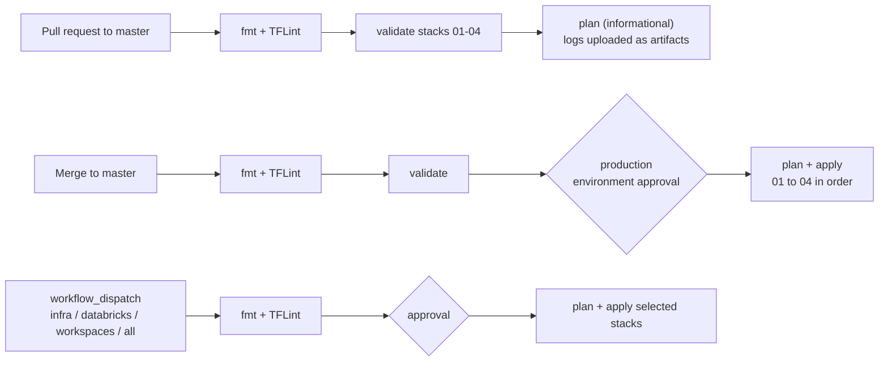

# CI/CD with GitHub Actions

Workflows live in [`.github/workflows/`](../.github/workflows/). All of them pin Terraform `1.13.3` and TFLint `v0.50.0`.



## Workflows

### `pr-validation.yml`: PR Validation

- **Trigger:** any pull request targeting `master`.
- **Jobs:** `lint` → `validate` (`terraform init -backend=false && terraform validate` per stack) → `plan`.
- The plan step **never fails the build**. Each stack's result is summarized and `stacks/*/plan.log` is uploaded as an artifact (kept 7 days). Plans for later stacks can legitimately fail on a fresh account before earlier stacks exist, which is why it's informational.

### `deploy.yml`: Deploy

- **Trigger:** push to `master` (in other words, a merged PR).
- **Jobs:** `lint` → `validate` → `plan-and-apply`.
- `plan-and-apply` runs in the `production` **environment**. With *required reviewers* set on that environment, the job waits for manual approval.
- Stacks are applied **sequentially** (01 → 02 → 03 → 04). Each one is planned to `tfplan.out` and that exact plan is applied, so what gets applied is exactly what was planned in that job. Plan logs are kept for 14 days.

### `deploy-targeted.yml`: Deploy (targeted)

- **Trigger:** manual (`Actions → Deploy (targeted) → Run workflow`).
- **Input `target`:**

  | Value | Stacks |
  |-------|--------|
  | `infra` | `01_infra` |
  | `databricks` | `02`, `03`, `04` |
  | `workspaces` | `04` |
  | `all` | `01`–`04` |

`00_bootstrap` is intentionally never run by CI. It has local state and creates the backend CI depends on.

---

## One-time setup

### 1. Create the GitHub OIDC identity provider in AWS

```
aws iam create-open-id-connect-provider \
  --url https://token.actions.githubusercontent.com \
  --client-id-list sts.amazonaws.com
```

(Newer AWS accounts don't need a thumbprint. Skip this step if the provider already exists.)

### 2. Create the deploy role

Trust policy. Replace `<ACCOUNT_ID>` and `<OWNER>/<REPO>`:

```
{
  "Version": "2012-10-17",
  "Statement": [{
    "Effect": "Allow",
    "Principal": { "Federated": "arn:aws:iam::<ACCOUNT_ID>:oidc-provider/token.actions.githubusercontent.com" },
    "Action": "sts:AssumeRoleWithWebIdentity",
    "Condition": {
      "StringEquals": { "token.actions.githubusercontent.com:aud": "sts.amazonaws.com" },
      "StringLike":   { "token.actions.githubusercontent.com:sub": [
        "repo:<OWNER>/<REPO>:ref:refs/heads/master",
        "repo:<OWNER>/<REPO>:environment:production",
        "repo:<OWNER>/<REPO>:pull_request"
      ]}
    }
  }]
}
```

Permissions: the role must be able to manage the resources in `01_infra` (VPC/EC2 networking, IAM roles and policies, S3) and read/write the state bucket. For a personal project `AdministratorAccess` is the simple choice. For production, scope it down, or use a read-only role for the `pull_request` subject and a separate read-write role for `production`.

### 3. Repository secrets

`Settings → Secrets and variables → Actions`:

| Secret | Value |
|--------|-------|
| `AWS_ROLE_ARN` | ARN of the deploy role above |
| `AWS_REGION` | e.g. `us-east-2` |
| `DATABRICKS_CLIENT_ID` | Account-level service principal application ID |
| `DATABRICKS_CLIENT_SECRET` | OAuth secret for that service principal |

The workflows map the Databricks secrets to `TF_VAR_databricks_client_id` / `TF_VAR_databricks_client_secret`.

### 4. `production` environment

`Settings → Environments → New environment → production`:

- Add **required reviewers**. This is the manual approval gate before `apply`.
- Optionally limit **deployment branches** to `master`.
- Optionally move the secrets from step 3 into the environment, so PR jobs can't read the write credentials.

---

## Notes and good practices

- **Runner tooling.** The trust-policy `local-exec` steps call the AWS CLI. `ubuntu-latest` has it preinstalled and the OIDC step exports the credentials.
- **Concurrency.** The S3 backend has no DynamoDB/`use_lockfile` locking configured. Avoid running two deploys at once; you can add `concurrency: { group: terraform, cancel-in-progress: false }` to the workflows or enable `use_lockfile = true` in the backends.
- **Local parity.** `pre-commit run -a` runs the same fmt/TFLint checks as the `lint` job, plus codespell and the hygiene hooks.
